# API Gateway & IAM

<!-- TOC -->

- [API Gateway & IAM](#démo-api-gateway--iam)
  - [Objectifs](#objectifs)
  - [Architecture du projet](#architecture-du-projet)
    - [API Gateway](#api-gateway)
    - [Authentification et autorisation avec Keycloak](#authentification-et-autorisation-avec-keycloak)
      - [Autorisation des accès avec OAuth 2.0](#autorisation-des-accès-avec-oauth-20)
      - [Authentification des utilisateurs avec OpenID Connect](#authentification-des-utilisateurs-avec-openid-connect)
      - [Cas d'usage](#cas-dusage)
    - [Backoffice - Google Online Boutique](#backoffice---google-online-boutique)
  - [Prérequis pour la suite](#prérequis-pour-la-suite)
  - [Comment utiliser ce projet ?](#comment-utiliser-ce-projet-)
    - [1. Récupérer le projet Github](#1-récupérer-le-projet-github)
    - [2. Créer un cluster K8S en local](#2-créer-un-cluster-k8s-en-local)
      - [Avec `Minikube` (conseillé)](#avec-minikube-conseillé)
      - [Avec `Kind`](#avec-kind)
    - [3. Créer d'un namespace `demo`](#3-créer-dun-namespace-demo)
    - [4. Déployer un `network policy` (optionnel)](#4-déployer-un-network-policy-optionnel)
    - [5. Déployer les stacks monitoring et tracing](#5-déployer-les-stacks-monitoring-et-tracing)
    - [6. Déployer **KrakenD**](#6-déployer-krakend)
    - [7. Déployer **Keycloak**](#7-déployer-keycloak)
    - [8. Déployer la boutique demo Google](#8-déployer-la-boutique-demo-google)
    - [9. Mettre à jour le fichier `/etc/hosts`](#9-mettre-à-jour-le-fichier-etchosts)
  - [Sécurisation des application et des APIs REST avec Keycloak](#sécurisation-des-application-et-des-apis-rest-avec-keycloak)
    - [Etape 1: Ajouter un `realm` nommé `demo`](#etape-1-ajouter-un-realm-nommé-demo)
    - [Etape 2: Ajouter un utilisateur `demo`](#etape-2-ajouter-un-utilisateur-demo)
    - [Etape 3: Autoriser notre application front à consommer les endpoints exposés par l'API Gateway](#etape-3-autoriser-notre-application-front-à-consommer-les-endpoints-exposés-par-lapi-gateway)
  - [Validation des JWT avec KrakenD](#validation-des-jwt-avec-krakend)
  - [Procédure de tests](#procédure-de-tests)
    - [Etape 1: Préparer l'environnement](#etape-1-préparer-lenvironnement)
    - [Etape 2. Récupérer le token d'accès (access token)](#etape-2-récupérer-le-token-daccès-access-token)
      - [Exemple avec le flux de code d'autorisation d'OIDC](#exemple-avec-le-flux-de-code-dautorisation-doidc)
      - [Exemple avec le flux d'authentification par mot de passe d'OAuth 2.0](#exemple-avec-le-flux-dauthentification-par-mot-de-passe-doauth-20)
    - [Etape 3. Tester les appels aux APIs via Postman](#etape-3-tester-les-appels-aux-apis-via-postman)
    - [4. Visualer les métriques de l'API Gateway](#4-visualer-les-métriques-de-lapi-gateway)
    - [5. Consulter les traces des requêtes exécutées](#5-consulter-les-traces-des-requêtes-exécutées)
  - [Comment arrêter/supprimer le cluster K8S ?](#comment-arrêtersupprimer-le-cluster-k8s-)
    - [Pour arrêter](#pour-arrêter)
    - [Pour supprimer](#pour-supprimer)
  - [References](#references)
    - [Kubernetes](#kubernetes)
    - [Ingress & Proxy](#ingress--proxy)
    - [API Gateway](#api-gateway-1)
    - [Network policy](#network-policy)
    - [Monitoring & Logging](#monitoring--logging)
    - [Tracing](#tracing)
    - [Microservices samples](#microservices-samples)
    - [Security](#security)

<!-- /TOC -->

## Objectifs

Ce projet a plusieurs objectifs :

* Valider une solution d'API Gateway pour centraliser les APIs REST exposées par notre backoffice.
* Câbler cette solution avec une brique d'authentification et d'autorisation pour sécuriser les accès et la consommation des ressources de nos services backend.
* Tracer les appels des microservices avec une une solution Open Source: [Opentracing](https://opentracing.io), [Opencensus](https://opencensus.io) ou [Opentelemetry](https://opentelemetry.io)
* Remonter les métriques d'usage via un dashboard Grafana


## Architecture du projet

Dans le cadre de ce projet, nous allons nous baser sur un projet exemple développé par Google pour illustrer nos services backend. Ce projet Open Source est une petite boutique en ligne assurée par dix microservices. Les APIs de ces microservices sont protégées par la brique `KrakenD` servant comme rôle d'API Gateway. La gestion d'authentification et d'autorisation des accès est assurée par `Keycloak`. Tous ces services sont orchestrés par un Kubernetes (K8S) en local. Une application web frontend de test est fournie pour illustrer et valider nos scénarios de tests. 

Voici un apperçu de l'architecture de notre projet:

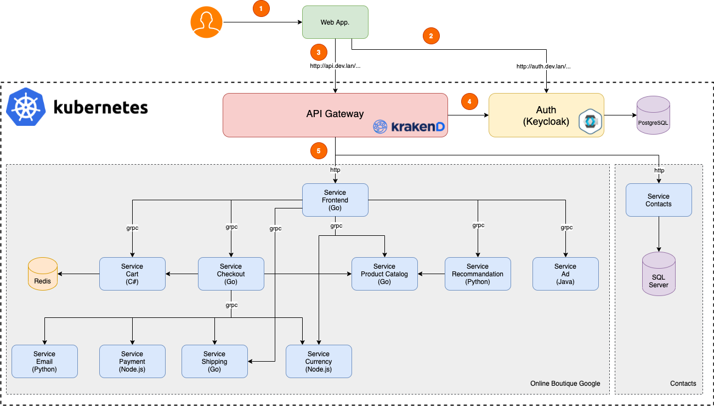

### API Gateway

L'**API Gateway** est un pattern très utilisé dans les architectures microservices. L'API Gateway est le point d'entrée unique pour toutes les applications frontend souhaitant consommer des services backend. C'est un composant technique qui se place devant les services/applications backend.

A ce jour, il existe différentes solutions d'API Gateway comme Tyk, Kong, Umbrella, WSO2, KrakenD, Apigee (Google), Azure API Management, etc. Dans le cadre de ce projet, nous implémentons la solution **KrakenD** mais une autre solution pourrait convenir.

**Présentation de la solution KrakenD**

[KrakenD](https://www.krakend.io/) est une solution d'API Gateway open source hautes performances développée en Go. Sa conception sans état (stateless) permet d'avoir une solution scalable facilement et rapidement. De plus, KrakenD offre plusieurs fonctionnalités très intéressantes :
* Prend en charge la validation et signature des JWT via un ID provider externe (Keycloak, Ory, Auth0, ...)
* Permet de définir le quotas d'utilisation au niveau de chaque endpoint
* Circuit breaker configurable : pour détecter les pannes et éviter de stresser le système
* Possibilité de configurer son propre service de découverte (service discovery) comme `Etcd`. 
* Aucune limite au niveau du nombre des enpoints et des services backends
* Gère des appels concurrents permettant de réduire le temps de réponse
* Propose un cache HTTP pour accélérer le temps de chargement côté client
* Gère le load balancing
* Permet d'agréger les données de plusieurs requêtes pour réduire la taille des données et répondre à des besoins spécifiques
* Architecture extensible : KrakenD a été conçu pour pouvoir ajouter d'autres fonctionnalités, plugins et middlewares sans modifier le code source
* Collecte les métriques d'usage
* Etc.


L'outil [KrakenDesigner](https://designer.krakend.io/#!/) nous offre la possibilité de concevoir nos APIs via une interface graphique simple et intuitive.

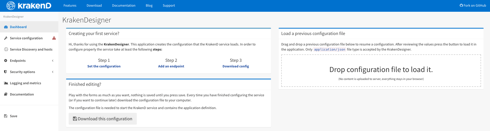


### Authentification et autorisation avec Keycloak

[Keycloak](https://www.keycloak.org) est une solution IAM (Identity and Access Management) adaptée aux applications web, mobile et les APIs REST.

Le projet a été lancé en 2014 pour aider les développeurs à sécuriser facilement leurs applications. Depuis, il est devenu un [projet open source](https://github.com/keycloak/keycloak) avec une grosse communauté de contributeurs (+500). Il est capable de gérer des millions d'utilisateurs en production. 

Keycloak fournit des pages de connexion entièrement personnalisables y compris une authentification forte (2FA), ainsi que divers flux, tels que la récupération de mots de passe, obligeant les utilisateurs à mettre à jour régulièrement les mots de passe et bien plus encore. Tout cela sans avoir besoin d'ajouter quoi que ce soit à nos applications, ni aucun codage. 

En déléguant l'authentification à Keycloak, les applications n'ont pas à se soucier des différents mécanismes d'authentification ou de la manière de stocker les mots de passe en toute sécurité. Cette approche offre également un niveau de sécurité plus élevé car les applications n'ont pas d'accès direct aux informations d'identification des utilisateurs; à la place, ils reçoivent des jetons de sécurité qui ne leur donnent accès qu'à ce dont ils ont besoin. 

Keycloak fournit une authentification unique ainsi que des capacités de gestion de session, permettant aux utilisateurs d'accéder à plusieurs applications, tout en n'ayant à s'authentifier qu'une seule fois. Les utilisateurs eux-mêmes et les administrateurs ont une visibilité totale sur l'endroit où les utilisateurs sont authentifiés et peuvent mettre fin aux sessions à distance si nécessaire.

Keycloak s'appuie sur des protocoles standard comme **OAuth 2.0**, **OpenID Connect** et **SAML 2.0**. L'utilisation de ces protocoles standard permet de simplifier l'intégration avec les applications existantes et nouvelles.


#### Autorisation des accès avec OAuth 2.0

OAuth 2.0 est un protocol standard très populaire pour l'autorisation des accès aux applications et APIs REST. Avec OAuth 2.0, le partage des données utilisateur avec des applications tierces est simple  et permet de contrôler les données partagées c'est-à-dire les informations d'identification de l'utilisateur ne sont pas partagées.

OAuth 2.0 est utile pour traiter avec des applications tierces et limiter l'accès à nos propres applications. Les informations d'identification (login et mot de passe) ne sont pas demandées à chaque fois qu'une application tierce se connecte à notre système ou consomme un de nos services.

Il y a quatre rôles définis dans OAuth 2.0 : 
* **Resource owner**: il s'agit généralement de l'utilisateur final qui possède les ressources auxquelles une application souhaite accéder. 
* **Resource server** : Il s'agit du service hébergeant les ressources protégées. 
* **Client** : il s'agit de l'application qui souhaite accéder à la ressource.
* **Authorization server** : c'est le serveur délivrant l'accès au client, qui est le rôle de Keycloak. 

Généralement, dans un flux de protocole OAuth 2.0, le client demande l'accès à une ressource au nom d'un propriétaire de ressource auprès du serveur d'autorisation. Le serveur d'autorisation délivre un accès limité à la ressource sous la forme d'un jeton d'accès (`access token`). Après avoir reçu le jeton d'accès, le client peut accéder à la ressource au niveau du serveur de ressources en incluant le jeton d'accès dans la demande.

Il existe plusieurs flux d'autorisation adaptés pour des cas d'usage spécifiques:
* **Client Credentials**: ce flux est à utiliser si une application accède à la ressource en son nom (l'application est le propriétaire de la ressource).
* **Device flow**: ce flus est réservé pour un appareil ou un objet connecté fonctionnant sans navigateur.
* **Authorization Code flow**: à utiliser si les deux contitions précédentes ne sont pas applicables.
* **Implicit flow**: il s'agissait d'un flux simplifié pour les applications natives et les applications côté client, qui est désormais considéré comme non sécurisé et ne doit pas être utilisé.
* **Resource Owner Password Credentials flow**: dans ce flux, l'application utilise directement les informations d'identification de l'utilisateur et les échange contre un jeton d'accès.


#### Authentification des utilisateurs avec OpenID Connect

OpenID Connect (OIDC) permet non seulement une authentification facile au sein de l'entreprise mais également il permet à des tiers (partenaires) d'accéder  aux applications au sein de l'entreprise sans avoir à créer des comptes individuels. Avec OIDC, les applications n'ont pas directement accès aux informations d'identification de l'utilisateur.

Comme OAuth 2.0, le protocole OIDC défini un certain nombre de rôles:
* **End User**: Utilisateur final
* **Relying Party**: . Il s'agit de la partie de confiance qui s'appuie sur le fournisseur OIDC pour vérifier l'identité de l'utilisateur. C'est notre application frontend.
* **OpenID Provider**: Le fournisseur d'identité qui authentifie l'utilisateur. C'est le rôle de notre Keycloak. 

Dans un flux OIDC, la partie de confiance demande l'identité de l'utilisateur final au fournisseur OpenID. Comme OIDC s'appuie sur OAuth 2.0, elle peut également obtenir un jeton d'accès en utilisant le `grant_type=authorization_code`. La différence avec OAuth 2.0 est que l'application client fourni dans la requête initiale un paramètre complémentaire `scope=openid` qui permet à OpenID de la considérer comme une requête d'authentification au lieu d'une requête d'autorisation. 

Il existe deux flux dans OIDC:
* **Authorization Code**: il utilise le même flux que le type de code d'autorisation de OAuth 2.0 et renvoie un code d'autorisation comme OAuth 2.0 qui peut être échangé contre un jeton d'identification (`id token`), un jeton d'accès, et un jeton d'actualisation (`refresh token`).
* **Hybrid**: dans le flux hybride, le jeton d'identification est renvoyé à partir de la demande initiale avec un code d'autorisation.

#### Cas d'usage

Dans ce projet, nous allons mettre en oeuvre les flux d'authentifcation et d'autorisation avec OAuth 2.0 et OIDC. Le diagramme des flux ci-desosus illustre les cas qui seront implémentés dans nos scénarii de tests.

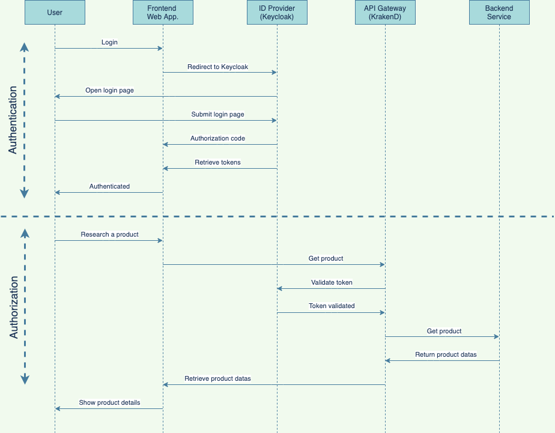


### Backoffice - Google Online Boutique

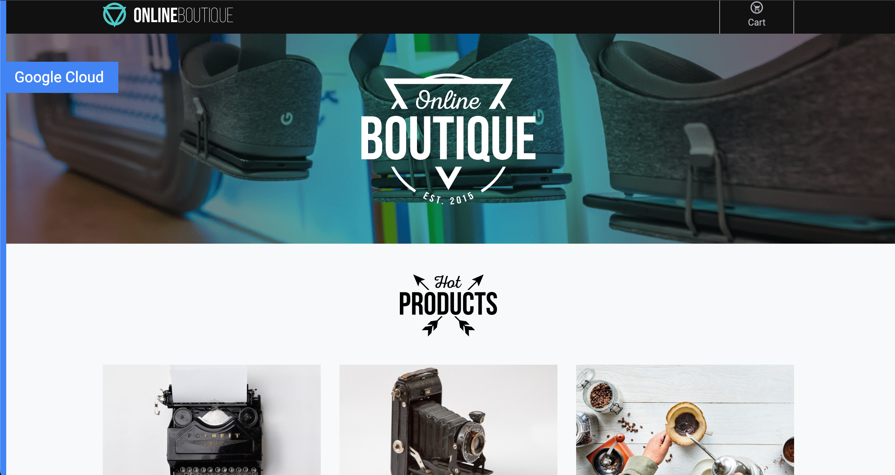

Comme évoqué précédemment, notre backoffice de test est [une boutique en ligne](https://github.com/GoogleCloudPlatform/microservices-demo) composée de plusieurs microservices. Ces derniers ont été développé avec des technologies adaptées au monde des microservices. Les sources des projets sont fournis et simples à faire évoluer si besoin.

Les échanges entre microservices se font pricipalement via le protocole GRPC. Seul le service `frontend` (application web) expose une API REST. Ce service est considéré comme un pattern d'agrégateur d'API dans son ensemble. Ce n'est pas un bon exemple pour notre POC. Il aurait fallu brancher directement l'API Gateway aux microservices de niveau n-1 sans passer par le service `frontend`, mais la tâche serait un peu plus compliquée car il faudra configurer KrakenD pour consommer les services via GRPC et non du RESTful. Ce cas est intéressant pour la suite mais ne présente pas d'intérêt pour notre scope. 

**Description des services backend:**

| Service                                              | Language      | Description                                                                                                                       |
| ---------------------------------------------------- | ------------- | --------------------------------------------------------------------------------------------------------------------------------- |
| [frontend]([https://github.com/GoogleCloudPlatform/microservices-demo/tree/master/src/frontend)                           | Go            | Exposes an HTTP server to serve the website. Does not require signup/login and generates session IDs for all users automatically. |
| [cartservice](https://github.com/GoogleCloudPlatform/microservices-demo/tree/master/src/cartservice)                     | C#            | Stores the items in the user's shopping cart in Redis and retrieves it.                                                           |
| [productcatalogservice](https://github.com/GoogleCloudPlatform/microservices-demo/tree/master/src/productcatalogservice) | Go            | Provides the list of products from a JSON file and ability to search products and get individual products.                        |
| [currencyservice](https://github.com/GoogleCloudPlatform/microservices-demo/tree/master/src/currencyservice)             | Node.js       | Converts one money amount to another currency. Uses real values fetched from European Central Bank. It's the highest QPS service. |
| [paymentservice](https://github.com/GoogleCloudPlatform/microservices-demo/tree/master/src/paymentservice)               | Node.js       | Charges the given credit card info (mock) with the given amount and returns a transaction ID.                                     |
| [shippingservice](https://github.com/GoogleCloudPlatform/microservices-demo/tree/master/src/shippingservice)             | Go            | Gives shipping cost estimates based on the shopping cart. Ships items to the given address (mock)                                 |
| [emailservice](https://github.com/GoogleCloudPlatform/microservices-demo/tree/master/src/emailservice)                   | Python        | Sends users an order confirmation email (mock).                                                                                   |
| [checkoutservice](https://github.com/GoogleCloudPlatform/microservices-demo/tree/master/src/checkoutservice)             | Go            | Retrieves user cart, prepares order and orchestrates the payment, shipping and the email notification.                            |
| [recommendationservice](https://github.com/GoogleCloudPlatform/microservices-demo/tree/master/src/recommendationservice) | Python        | Recommends other products based on what's given in the cart.                                                                      |
| [adservice](https://github.com/GoogleCloudPlatform/microservices-demo/tree/master/src/adservice)                         | Java          | Provides text ads based on given context words.                                                                                   |
| contacts                 | C#/.Net ? | Simple contacts management tool.                                              |


## Prérequis pour la suite

* [Minikube](https://minikube.sigs.k8s.io/docs/start/) installé ou une autre solution ([Kind](https://kind.sigs.k8s.io/docs/user/quick-start), Docker Desktop avec Kubernetes activé, ...)
* Linux ou MacOS avec minimum un processeur i5 et 16 Go de RAM
* Le client Kubernetes `kubectl` installé
* [Helm 3](https://helm.sh/docs/) - le gestionnaire de packages pour Kubernetes

## Comment utiliser ce projet ?

### 1. Récupérer le projet Github

Commençons par récuper le projet sur notre poste de travail:

```
git clone https://github.com/nntran/sample-api-gateway.git
```

### 2. Créer un cluster K8S en local

Les tests de l'API Gateway se feront via un cluster K8S en local. Pour se faire, nous pouvons utiliser `Minikube` ou `Kind` ou tout autres solutions.

#### Avec `Minikube` (conseillé)

Créons une instance K8S avec 4 CPU et 8 Go de RAM:

```sh
minikube start -p k8s-demo --kubernetes-version=v1.20.0 --cpus=4 --memory 8192 --disk-size 32g

😄  [k8s-demo] minikube v1.22.0 sur Darwin 11.5.2
✨  Choix automatique du pilote hyperkit. Autres choix: virtualbox, ssh
👍  Démarrage du noeud de plan de contrôle k8s-demo dans le cluster k8s-demo
🔥  Création de VM hyperkit (CPUs=4, Mémoire=8192MB, Disque=32768MB)...
🐳  Préparation de Kubernetes v1.20.0 sur Docker 20.10.6...
    ▪ Génération des certificats et des clés
    ▪ Démarrage du plan de contrôle ...
    ▪ Configuration des règles RBAC ...
🔎  Vérification des composants Kubernetes...
    ▪ Utilisation de l'image gcr.io/k8s-minikube/storage-provisioner:v5
🌟  Modules activés: storage-provisioner, default-storageclass
🏄  Terminé ! kubectl est maintenant configuré pour utiliser "k8s-demo" cluster et espace de noms "default" par défaut.
```

Sous MacOS, Minikube utilise par défaut l'hyperviseur `hyperkit` (version Big Sur ou inférieure) pour monter une machine virtuelle (VM). Il est possible de spécifier notre hyperviseur préféré via l'option `--vm-driver=[hyperkit|virtualbox|...]`.

#### Avec `Kind`

Créons un cluster K8S avec trois noeuds (1 master et 2 workers) en se basant sur le fichier de configuration [kind-cluster-3n.yaml](./config/cluster/kind/cluster-3n.yaml):

```sh
kind create cluster --name k8s-demo --config config/cluster/kind/cluster-3n.yaml 

Creating cluster "k8s-demo" ...
✓ Ensuring node image (kindest/node:v1.20.2) 🖼
✓ Preparing nodes 📦 📦 📦
✓ Writing configuration 📜
✓ Starting control-plane 🕹️
✓ Installing StorageClass 💾
✓ Joining worker nodes 🚜
Set kubectl context to "k8s-demo"
You can now use your cluster with:

kubectl cluster-info --context k8s-demo

Have a nice day! 👋
```

### 3. Créer d'un namespace `demo`

Nous regroupons nos services dans un namespace `demo` pour isoler des services existants.

```sh
kubectl create namespace demo
```

### 4. Déployer un `network policy` (optionnel)

Si le cluster K8S a été créé avec Kind (plusieurs noeuds) alors il nous faudrait installer un `network policy` afin que les services puissent communiquer entre les noeuds.

Il existe différentes solutions (Weave, Calico, Cilium, ...) en fonction de ce que nous souhaitons rechercher en terme de fonctionnalités. Dans le cadre de ce poc, nous utilisons la solution `Weave`. Ci-dessous la commande pour la déployer: 

```sh
kubectl apply -f "https://cloud.weave.works/k8s/net?k8s-version=$(kubectl version | base64 | tr -d '\n')"
```

Pour accéder à certains services (API Gateway, ...) déployés dans K8S depuis notre machine locale, il nous faudrait un `ingress controller` (sorte de loadbalancer/proxy). 

Contrairement à d'autres solutions d'API Gateway (ex: Kong), KrakenD ne propose pas cette fonctionnalité. Nous allons donc utiliser la solution open source `Traefik`. La commande suivante permet de déployer `Traefik` dans le namespace `demo`:

```sh
kubectl apply -f addons/traefik -n demo
```

**Remarque :** Il est possible d'utiliser une des deux solutions embarquées par défaut dans `Minikube` :
* `ambassador` : [Ambassador](https://minikube.sigs.k8s.io/docs/tutorials/ambassador_ingress_controller/-)
* `ingress` : Nginx

Par exemple, pour activer la solution Ambassador: 

```sh
minikube -p k8s-demo addons enable ambassador
```

Si Ambassador ou Nginx est utilisé, il faut penser à modifier l'annotation de l'ingress des services exposés, par exemple pour KrakenD:

[krakend-ingress.yaml](addons/api-gateway/krakend/krakend-ingress.yaml)
```yaml
# content of krakend-ingress.yaml
---
apiVersion: networking.k8s.io/v1
kind: Ingress
metadata:
name: api-gateway
annotations:
    # Annotation pour Traefik
    traefik.ingress.kubernetes.io/router.entrypoints: http
    # Annotation pour Ambassador
    # kubernetes.io/ingress.class: ambassador
spec:
rules:
    - host: api.dev.lan
    http:
        paths:
        - pathType: Prefix
            path: /
            backend:
            service: 
                name: api-gateway
                port: 
                number: 8080
```


### 5. Déployer les stacks monitoring et tracing

Pour nous aider à comprendre les intéractions entre les différentes briques techniques de notre architecture, nous souhaitons monitorer nos services et tracer nos requêtes API. Pour cela, nous devons installer les trois outils suivants:

* Grafana

    ```sh
    kubectl create namespace monitoring
    kubectl apply -f addons/monitoring/grafana -n monitoring
    ```

* Prometheus

    ```sh
    helm repo add prometheus-community https://prometheus-community.github.io/helm-charts
    helm repo add kube-state-metrics https://kubernetes.github.io/kube-state-metrics
    helm repo update

    helm install prometheus prometheus-community/prometheus -n monitoring --create-namespace -f addons/monitoring/prometheus/values.yaml
    ```

* Jaeger

    ```sh
    kubectl apply -f addons/monitoring/tracing -n monitoring
    ```

* InfluxDB

    ```sh
    kubectl apply -f addons/monitoring/influxdb -n monitoring
    ```

### 6. Déployer **KrakenD**

Les fichiers de déploiement se trouve dans [addons/addons/api-gateway/karkend](addons/addons/api-gateway/karkend).

```sh
kubectl apply -f addons/api-gateway/krakend -n demo

configmap/krakend-config created
deployment.apps/krakend created
ingress.networking.k8s.io/api-gateway created
service/api-gateway created
```

Exemple de configuration des endpoints de l'API Gateway KrakenD:

[krakend-cfg.json](config/krakend-cfg.json)


### 7. Déployer **Keycloak**

Les fichiers de déploiement se trouve dans [addons/security/keycloak](addons/security/keycloak).

```sh
kubectl apply -f addons/security/keycloak -n demo


```

### 8. Déployer la boutique demo Google

Les fichiers de déploiement `yaml` des microservices se trouvent dans le dossier [services/google-market](./services/google-market) du projet.

Pour déployer la boutique dans le namespace `demo` (sans le service loadgenerator): 

```
kubectl apply -f services/google-market -n demo

deployment.apps/adservice created
service/adservice created
deployment.apps/redis-cart created
service/redis-cart created
deployment.apps/cartservice created
service/cartservice created
deployment.apps/checkoutservice created
service/checkoutservice created
deployment.apps/currencyservice created
service/currencyservice created
deployment.apps/emailservice created
service/emailservice created
deployment.apps/frontend created
service/frontend created
ingress.networking.k8s.io/frontend-external created
deployment.apps/paymentservice created
service/paymentservice created
deployment.apps/productcatalogservice created
service/productcatalogservice created
deployment.apps/recommendationservice created
service/recommendationservice created
deployment.apps/shippingservice created
service/shippingservice created
```


### 9. Mettre à jour le fichier `/etc/hosts`

Cette dernière étape nous permet de paramétrer les accès à certaines applications déployées dans Kubernetes en passant par le domaine `dev.lan`.

Pour se faire, il suffit d'exécuter les commandes ci-dessous en remplaçant `<IP_LB_INGRESS>` par l'adresse IP externe du cluster K8S:

```
sudo echo '<IP_LB_INGRESS>  api.dev.lan' >> /etc/hosts
sudo echo '<IP_LB_INGRESS>  keycloak.dev.lan' >> /etc/hosts
sudo echo '<IP_LB_INGRESS>  jaeger.dev.lan' >> /etc/hosts
sudo echo '<IP_LB_INGRESS>  frontend.dev.lan' >> /etc/hosts
sudo echo '<IP_LB_INGRESS>  traefik.dev.lan' >> /etc/hosts
sudo echo '<IP_LB_INGRESS>  grafana.dev.lan' >> /etc/hosts
```

L'adresse IP externe (EXTERNAL-IP) peut être obtenu via cette commande:

* Traefik

    ```
    kubectl get svc -n demo -o wide -l app=traefik

    NAME                TYPE           CLUSTER-IP     EXTERNAL-IP    PORT(S)                      AGE   SELECTOR
    traefik             LoadBalancer   10.98.61.229   10.98.61.229   80:32186/TCP,443:32421/TCP   76s   app=traefik
    traefik-ui          ClusterIP      10.98.97.174   <none>         8080/TCP                     76s   app=traefik
    ```

* Ambassador 

    ```
    kubectl get svc ambassador -n ambassador

    NAME         TYPE           CLUSTER-IP    EXTERNAL-IP   PORT(S)                      AGE
    ambassador   LoadBalancer   10.98.51.69   10.98.51.69   80:31040/TCP,443:30950/TCP   164m
    ```

Avec Minikube, il est possible de simplifier ces manipulations en activant le addons `ingress-dns`

```
minikube -p k8s-demo addons enable ingress-dns
```

Plus de détails [ici...](https://minikube.sigs.k8s.io/docs/handbook/addons/ingress-dns/)


Il est possible de `forwarder` les ports des services sans passer par la méthode précédente. Voici un exemple pour accéder à l'interface web de Traefik sur le port 8080:

```
kubectl port-forward svc/traefik-dashboard -n demo 8080:8080
```

Nous devrons maintenant avoir accès à ces différentes URLs depuis notre navigateur: 

* [Traefik](http://traefik.dev.lan/dashboard#)
* [Jaeger](http://jaeger.dev.lan/)
* [Frontend](http://frontend.dev.lan/)
* [Keycloak](http://keycloak.dev.lan)
* [Grafana](http://grafana.dev.lan)


## Sécurisation des application et des APIs REST avec Keycloak

Dans cette section, nous allons utiliser la console d'administration de Keycloak pour mettre en place une configuration basique pour sécuriser les accès à nos ressources backend.

Pour accéder à la console d'admin de Keycloak, il faut aller sur [http://keycloak.dev.lan](http://keycloak.dev.lan) et cliquer sur le lien `Administration Console` depuis notre navigateur. Keycloak devrait nous rediriger vers la page de connexion que nous devons utiliser l'utilisateur `admin` et le mot de passe `admin` pour nous connecter. Il est possible d'accéder directement à cette page de login via l'url http://keycloak.dev.lan/auth/admin.

Une fois connecté, nous devrons avoir la configuration par défaut du `realm master` de Keycloak.

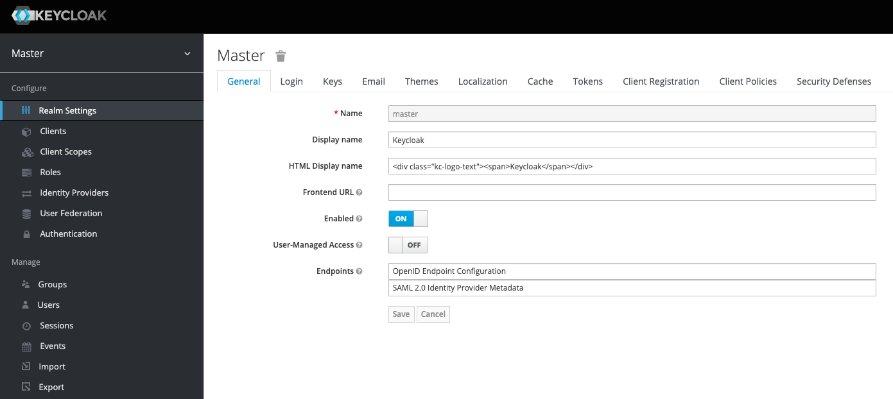


### Etape 1: Ajouter un `realm` nommé `demo`

Un `realm` est une sorte de tenant (configuration spécifique à un client). Il possède sa propre configuration (applications, utilisateurs, rôles, ...). Cela permet d'avoir une seule instance de Keycloak pour servir plusieurs clients (merketplace).

Pour créer un nouveau realm, il faut cliquer sur `Add realm` depuis le menu du realm master.

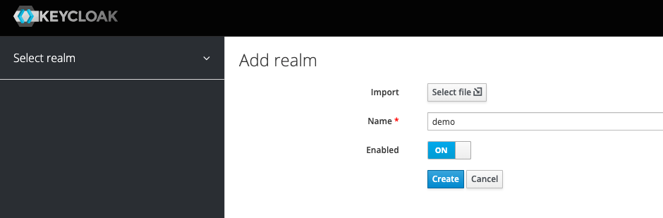

Saisissons `demo` dans le champs `Name` puis validons en cliquant sur le bouton `Create`.

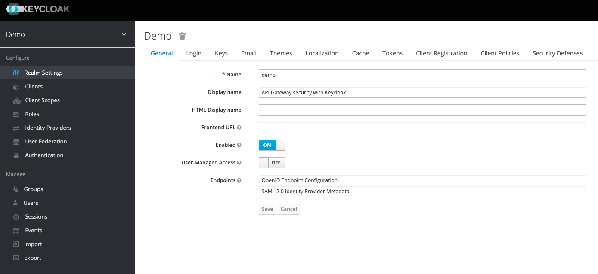

Ajoutons une description à notre realm demo au niveau du champs `Display name`. Keycloak utilisera ce libellé comme description de la page d'authentifcation que nous verrons un peu plus loin.

Il est possible d'obtenir une liste de configuration d'un realm donné en utilisant l'url `http://keycloak.dev.lan/auth/realms/demo/.well-known/openid-configuration`. Par exemple, pour lister le realm `demo` avec `curl`:

```
curl http://keycloak.dev.lan/auth/realms/demo/.well-known/openid-configuration | jq
```

```json
{
    "issuer": "http://keycloak.dev.lan/auth/realms/demo",
    "authorization_endpoint": "http://keycloak.dev.lan/auth/realms/demo/protocol/openid-connect/auth",
    "token_endpoint": "http://keycloak.dev.lan/auth/realms/demo/protocol/openid-connect/token",
    "introspection_endpoint": "http://keycloak.dev.lan/auth/realms/demo/protocol/openid-connect/token/introspect",
    "userinfo_endpoint": "http://keycloak.dev.lan/auth/realms/demo/protocol/openid-connect/userinfo",
    "end_session_endpoint": "http://keycloak.dev.lan/auth/realms/demo/protocol/openid-connect/logout",
    "jwks_uri": "http://keycloak.dev.lan/auth/realms/demo/protocol/openid-connect/certs",
    "check_session_iframe": "http://keycloak.dev.lan/auth/realms/demo/protocol/openid-connect/login-status-iframe.html",
    "grant_types_supported": [
        "authorization_code",
        "implicit",
        "refresh_token",
        "password",
        "client_credentials",
        "urn:ietf:params:oauth:grant-type:device_code",
        "urn:openid:params:grant-type:ciba"
    ],
    "response_types_supported": [
        "code",
        "none",
        "id_token",
        "token",
        "id_token token",
        "code id_token",
        "code token",
        "code id_token token"
    ],
    ...
}
```

### Etape 2: Ajouter un utilisateur `demo`

Pour s'authentifier auprès de Keycloak, il nous faut un utilisateur. Pour cela, nous allons créer un utilisateur `demo` avec le mot de passe `demo`.

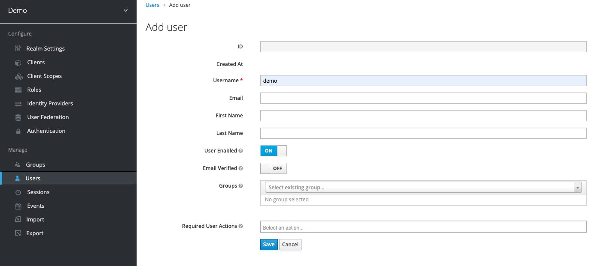

Remplissons juste le champs obligatoire `Username` et validons le formulaire.
Keycloak nous redirige vers l'écran de configuration détaillée de notre utilisateur. 

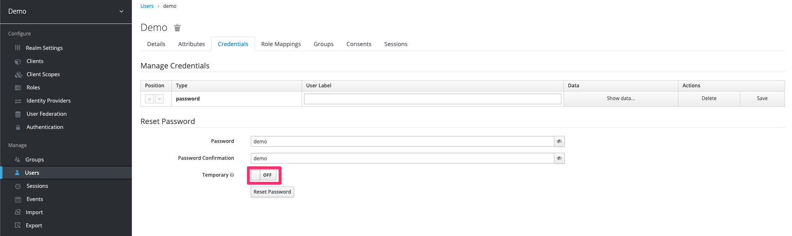


### Etape 3: Autoriser notre application front à consommer les endpoints exposés par l'API Gateway

Déclarons un nouveau client nommé `front-demo-app` via le menu `Clients` de Keycloak.

Il faut obligatoirement ces informations:
* **Client ID**: front-demo-app 
* **Access Type**: public 
* **Valid Redirect URIs**: http://localhost:8000/ 
* **Web Origins**: http://localhost:8000


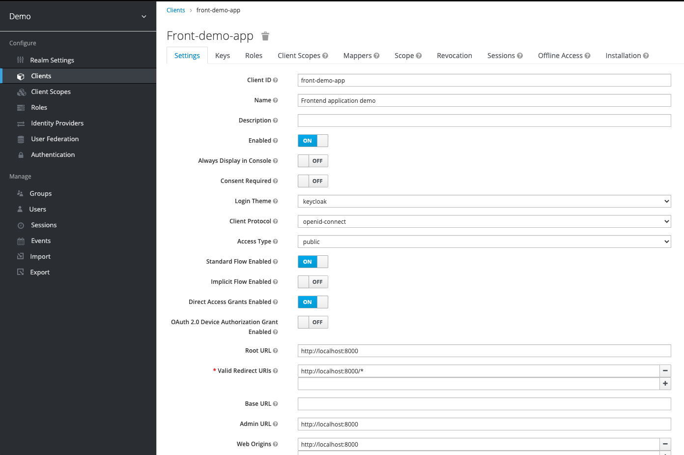


## Validation des JWT avec KrakenD

Pour valider le token passé à la requête http(s), il faut ajouter le validateur au niveau de chaque endpoint du fichier de configuration de `Krakend`.

```json
"extra_config": {
    "github.com/devopsfaith/krakend-jose/validator": {
        "alg": "RS256",
        "jwk-url": "http://keycloak:8080/auth/realms/demo/protocol/openid-connect/certs",
        "disable_jwk_security": true
    }
},
```

Par exemple, pour sécuriser le endpoint `/v1/product/{id}`:

```json
...        
{
    "endpoint": "/v1/product/{id}",
    "method": "GET",
    "output_encoding": "no-op",
    "extra_config": {
        "github.com/devopsfaith/krakend-jose/validator": {
            "alg": "RS256",
            "jwk-url": "http://keycloak:8080/auth/realms/demo/protocol/openid-connect/certs",
            "disable_jwk_security": true
        }
    },
    "backend": [
        {
            "url_pattern": "/product/{id}",
            "encoding": "no-op",
            "method": "GET",
            "sd": "static",
            "host": [
                "http://frontend:8080"
            ]
        }
    ]
},
...
```

## Procédure de tests

### Etape 1: Préparer l'environnement

* Démarrer le cluster Kubernetes  (si ce n'est pas été fait)
  
    ```sh
    minikube start -p k8s-demo

    😄  [k8s-demo] minikube v1.23.2 sur Darwin 12.0.1
    🆕  Kubernetes 1.22.2 est désormais disponible. Si vous souhaitez effectuer une mise à niveau, spécifiez : --kubernetes-version=v1.22.2
    🎉  minikube 1.24.0 est disponible ! Téléchargez-le ici : https://github.com/kubernetes/minikube/releases/tag/v1.24.0
    💡  To disable this notice, run: 'minikube config set WantUpdateNotification false'

    ✨  Utilisation du pilote docker basé sur le profil existant
    👍  Démarrage du noeud de plan de contrôle k8s-demo dans le cluster k8s-demo
    🚜  Extraction de l'image de base...
    🔄  Redémarrage du docker container existant pour "k8s-demo" ...
    🐳  Préparation de Kubernetes v1.20.0 sur Docker 20.10.8...
    🔎  Vérification des composants Kubernetes...
        ▪ Utilisation de l'image gcr.io/k8s-minikube/storage-provisioner:v5
    🌟  Modules activés: storage-provisioner, default-storageclass

    ❗  /usr/local/bin/kubectl est la version 1.22.4, qui peut comporter des incompatibilités avec Kubernetes 1.20.0.
        ▪ Vous voulez kubectl v1.20.0 ? Essayez 'minikube kubectl -- get pods -A'
    🏄  Terminé ! kubectl est maintenant configuré pour utiliser "k8s-demo" cluster et espace de noms "default" par défaut.
    ```

* Activer le tunnel

    En activant le tunnel, minikube se charge de rediriger les traffics http(s) entrants vers le service ingress Kuberntes. 
    Exemple avec Traefik:

    ```
    minikube tunnel -p k8s-demo

    ❗  Le service/ingress traefik nécessite l'exposition des ports privilégiés : [80 443]
    🔑  sudo permission will be asked for it.
    🏃  Tunnel de démarrage pour le service traefik.
    ❗  Le service/ingress traefik-ui nécessite l'exposition des ports privilégiés : [80 443]
    🔑  sudo permission will be asked for it.
    🏃  Tunnel de démarrage pour le service traefik-ui.
    ```

* Afficher les logs des services

    Pour suivre les appels de nos différents services (api-gateway, frontend, ...), nous affichons les logs dans différents terminaux en utilisant la commande `kubectl logs -n demo --selector app=<nom service> --follow`. Voici quelques exemples: 

    * Keycloak

        ```
        kubectl logs -n demo --selector app=keycloak --follow
        ```
        
    * KrakenD

        ```
        kubectl logs -n demo --selector app=api-gateway --follow
        ```

    * Traefik

        ```
        kubectl logs -n demo --selector app=traefik --follow
        ```

### Etape 2. Récupérer le token d'accès (access token)

Il y a deux façon de récupérer le token d'accès `access_token`:
* Soit en utilisant le flux d'authentification par code d'autorisation d'OIDC
* Soit en utilisant le flux d'authentification par mot de passe d'OAuth 2.0

#### Exemple avec le flux de code d'autorisation d'OIDC

Comme expliqué précédemment dans le chapitre de Keycloak, ce flux d'authentification a besoin de deux paramètres `grant_type=authorization_code` et `scope=openid` pour fonctionner. Pour simuler ce flux d'authentification, il y a une application écrit en NodeJS fourni avec ce projet. Elle se trouve dans dans le dossier `src/frontend-demo-app`. Ouvrons un terminal à partir de ce dossier et lançons les deux commandes suivantes pour la démarrer.

```sh
npm install
npm start
```

L'application est normalement accessible via l'url http://localhost:8000. 

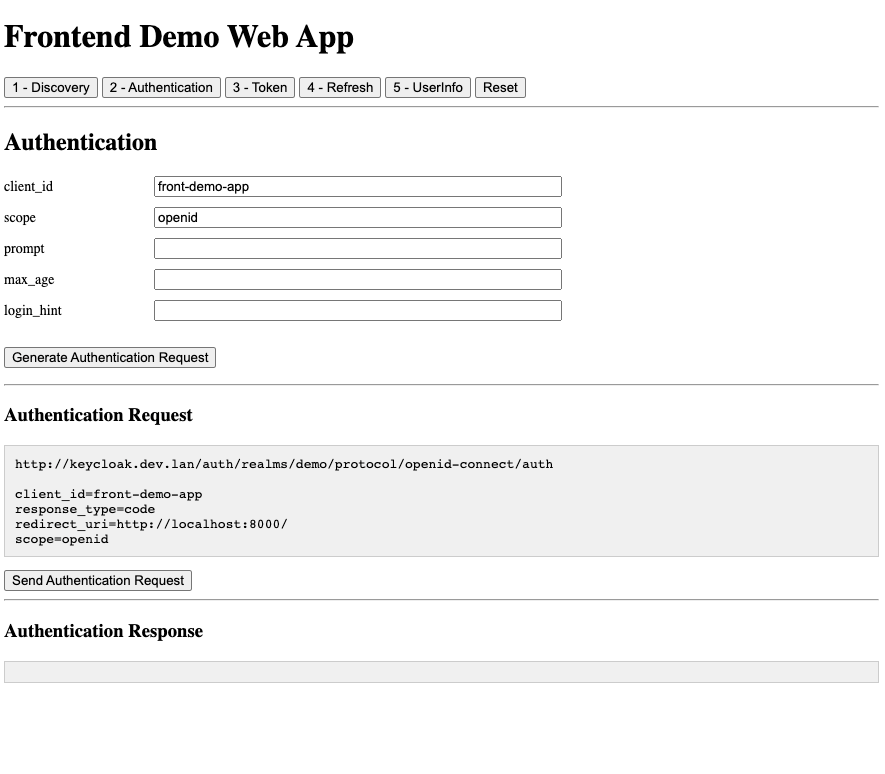

Pour obtenir le token d'accès, il faut charger la configuration du realm `demo` (1 - Discovery) puis exécuter l'étape d'authentification (2 - Authentication). Une fois que la requête est envoyé au serveur Keycloak, l'application nous redirige vers la boîte de dialog de saisi de nos identifiants. 

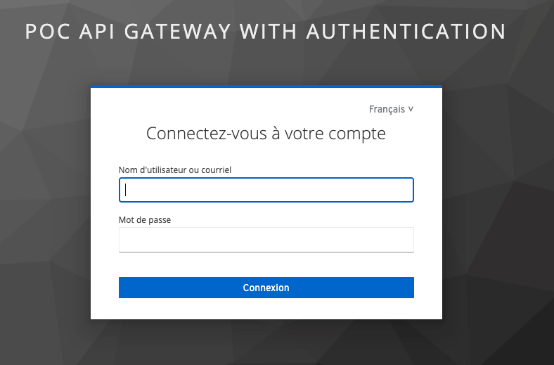

Utilisons les informations de l'utilisateur `demo` que nous avons créé précédemment pour nous connecter. 
L'application devrait nous afficher le code d'authorisation fourni par Keycloak. Par exemple:

```
code=67f3f3c0-06ac-4ca0-9cd9-2c8615894c2f.ceeed363-f161-419f-b5f3-c0a2e5a0ac82.8b580b00-b9db-4abe-b442-4777b4fd2117
```

Ce code sera fourni en paramètre de l'étape d'obtention du token d'accès (3 - Token). Il suffit de cliquer sur le bouton `Send Token Request` pour que Keycloak nous génrer le token d'accès.

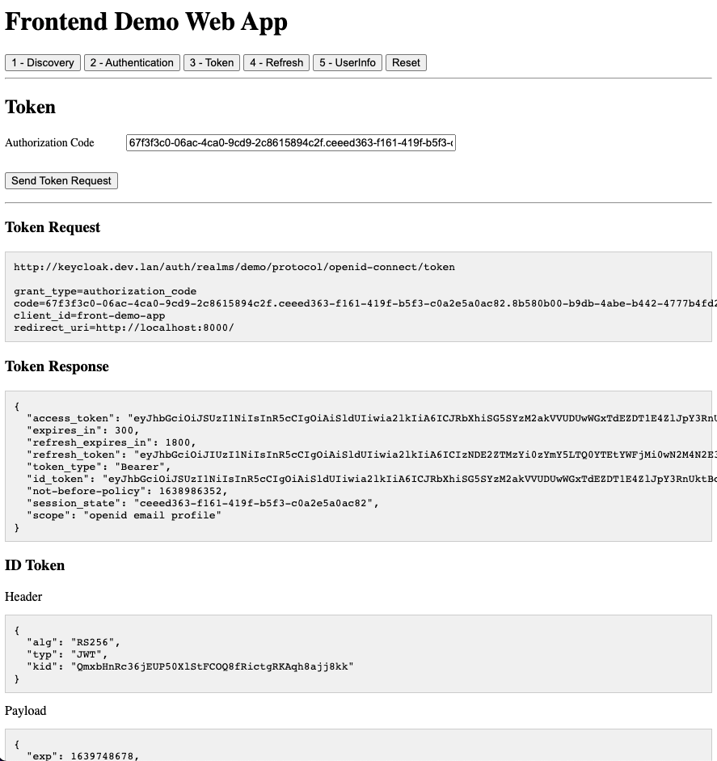


#### Exemple avec le flux d'authentification par mot de passe d'OAuth 2.0

Récupérons la collection Postman fourni dans le dossier [test/api-gateway.postman_collection.json](test/api-gateway.postman_collection.json) et exécutons la requête `Get Token` dans le dossier `keycloak`:

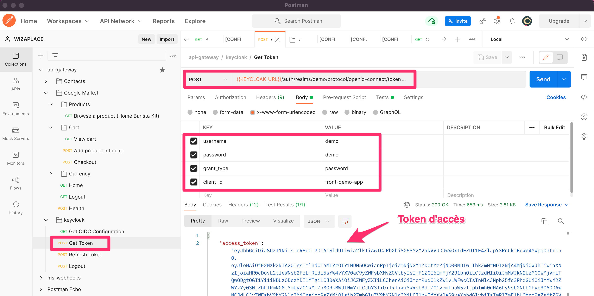

Le token d'accès est affiché dans le body de la réponse. Il y a un script javascript qui met à jour automatiquement les deux variables `ID_TOKEN` et `REFRESH_TOKEN` après chaque exécution de cette requête.

```js
pm.test("Successful POST request", function () {
    pm.expect(pm.response.code).to.be.oneOf([200]);
});

let jsonData = pm.response.json();
console.log(jsonData);
pm.collectionVariables.set("ID_TOKEN", jsonData.access_token);
pm.collectionVariables.set("REFRESH_TOKEN", jsonData.refresh_token);
```

**Remarque:** cette requête utilise le paramètre `grant_type=password` pour indiquer à Keycloak que nous lui envoyons des identifiants de connexion.

Il est possible de générer le token d'accès via la commande `curl`:

```sh
curl -X POST "http://keycloak.dev.lan/auth/realms/demo/protocol/openid-connect/token" "--insecure" \
-H "Content-Type: application/x-www-form-urlencoded" \
-d "username=demo" \
-d "password=demo" \
-d 'grant_type=password' \
-d "client_id=front-demo-app" | jq -r '.access_token'
```

```
eyJhbGciOiJSUzI1NiIsInR5cCIgOiAiSldUIiwia2lkIiA6ICJoZXN2R3dZMWw2M0ZFZVZEVzF5Qk5Vd2R1RXJYTU1mSFlqTnZ5cjRpWlMwIn0.eyJleHAiOjE2MzU4NTk1NDIsImlhdCI6MTYzNTg1OTI0MSwianRpIjoiNWU0ZDc3MjktODE1NS00MmQ2LTkzZWUtYjEzMTZiYTViZDg5IiwiaXNzIjoiaHR0cDovL2tleWNsb2FrLmRldi5sYW4vYXV0aC9yZWFsbXMvZGVtbyIsImF1ZCI6ImFjY291bnQiLCJzdWIiOiIxODY3ZDExZC05ZjQyLTQxZTMtYWY3Yy0yZTA2ZWEzZGEwYjQiLCJ0eXAiOiJCZWFyZXIiLCJhenAiOiJhcGktZ2F0ZXdheSIsInNlc3Npb25fc3RhdGUiOiJmYTJiNzk3NS0xOWRiLTRkNTYtOWQzNy00MjM2NTUwODg3YjYiLCJhY3IiOiIxIiwiYWxsb3dlZC1vcmlnaW5zIjpbImh0dHA6Ly9hcGktZ2F0ZXdheTo4MDgwIl0sInJlYWxtX2FjY2VzcyI6eyJyb2xlcyI6WyJvZmZsaW5lX2FjY2VzcyIsInVtYV9hdXRob3JpemF0aW9uIiwiZGVmYXVsdC1yb2xlcy1kZW1vIl19LCJyZXNvdXJjZV9hY2Nlc3MiOnsiYWNjb3VudCI6eyJyb2xlcyI6WyJtYW5hZ2UtYWNjb3VudCIsIm1hbmFnZS1hY2NvdW50LWxpbmtzIiwidmlldy1wcm9maWxlIl19fSwic2NvcGUiOiJlbWFpbCBwcm9maWxlIiwic2lkIjoiZmEyYjc5NzUtMTlkYi00ZDU2LTlkMzctNDIzNjU1MDg4N2I2IiwiZW1haWxfdmVyaWZpZWQiOmZhbHNlLCJwcmVmZXJyZWRfdXNlcm5hbWUiOiJkZW1vIn0.a6rHv9DKyQNUpK8RUO7_L3EYQjI7YPriunLWzeQgTXpRxwfKh0xNxfng7P19icnrV8AJseO27xHpZHqmi_I6kCxFmYKSWqbx0DcIT8CC4F4JLGnkGt846Y9Fph61ZNiWKSCRFGhZ8GLd7zAz4OISoEM5MFWBIWRz66xP0EdrjeYKBeP2nIu5SKGyPszPTs_DWlx3zeuvq9LAjm1l8qX4fjT81aKzZ-x94chjaow6aUSGLvlEjrtLgsU4o7bKfHFLEMwpF1ci1tcdEFuHzzANm6iPc6tiPkO88yZJaetJgqVw5ZGnJTR1hey_CN-WcjCj8oyZDokVzqS4rvY12O_9Mg
```

Ce token est à mettre à jour au niveau de la variable `ID_TOKEN` dans Postman.

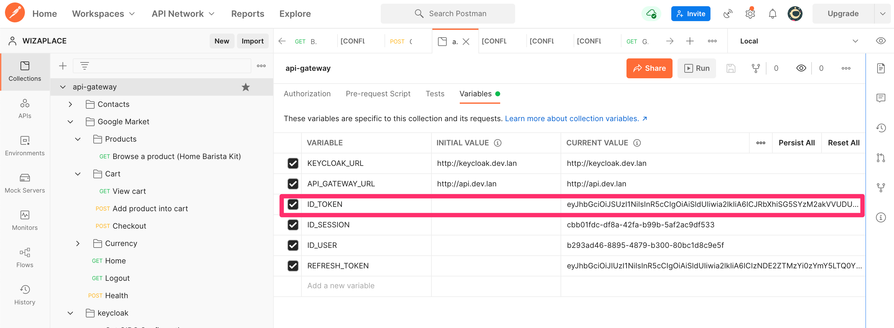


### Etape 3. Tester les appels aux APIs via Postman

  * Recherche du produit **Home Barista Kit (ID: 1YMWWN1N4O)**
  
    GET http://api.dev.lan/v1/product/1YMWWN1N4O
    
    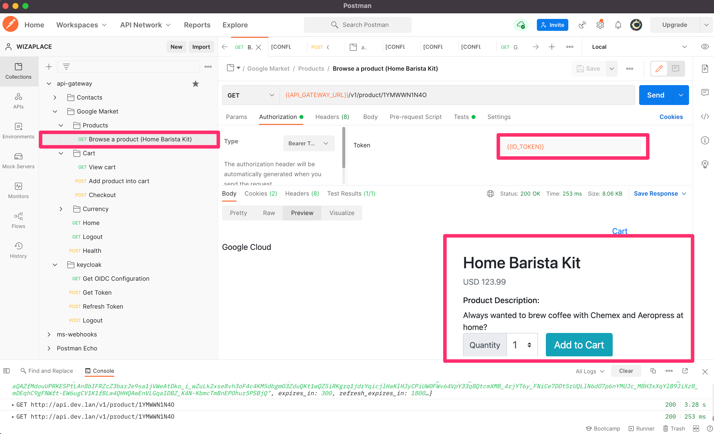

    Si le `token` n'est pas valide, l'API Gateway retourne le code HTTP 401 (Unauthorized).
    Dans les logs de Krakend, nous aurons ce message d'erreur:
    ```
    Error #01: square/go-jose/jwt: validation failed, token is expired (exp)
    ```


### 4. Visualer les métriques de l'API Gateway

Pour visualiser les métriques remontées par KrakenD, il faut importer le dashboard `config/krakend_rev1-dashboard.json` dans Grafana en utilisant la `data source` `influxdb`. Voici les informations pour déclarer ce data source:
* URL: http://influxdb:8086
* Acces: server
* Database: krakend
* User: demo
* Password: krakend

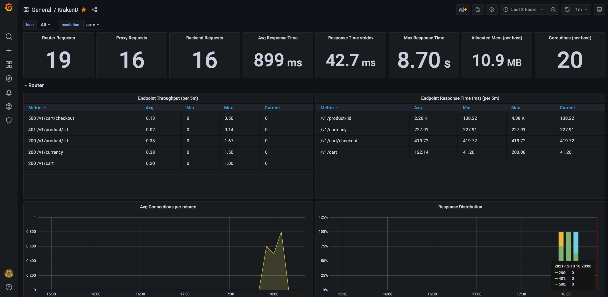


### 5. Consulter les traces des requêtes exécutées

Normalement, les traces des requêtes sont envoyées au serveur Jaeger. Ces traces peuvent être consultées avec le dashboard de Jaeger ou avec Grafana.

* Avec Jaeger (http://jaeger.dev.lan)
  
    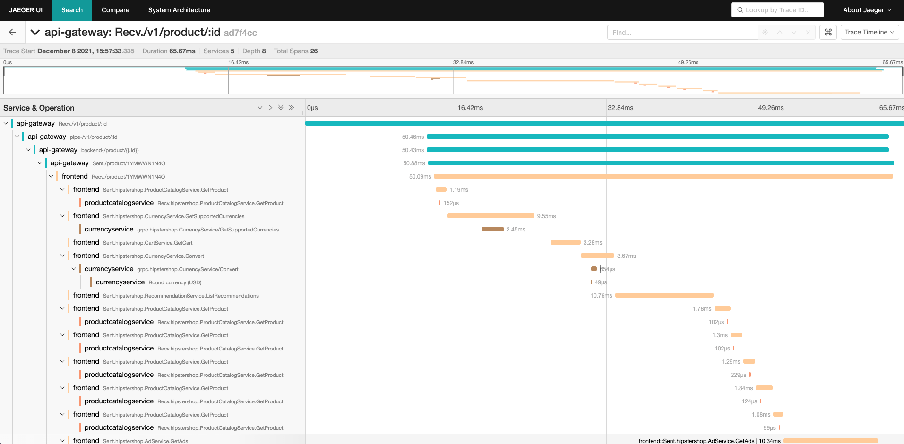

* Avec Grafana (http://grafana.dev.lan)

    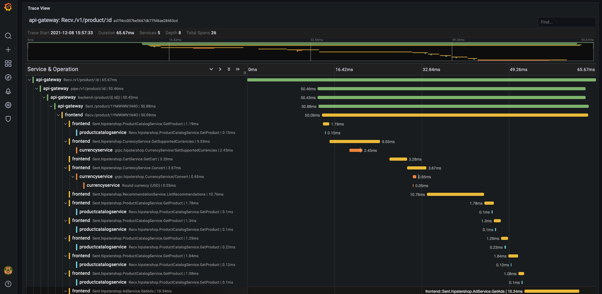


## Comment arrêter/supprimer le cluster K8S ?

### Pour arrêter

* Minikube

    ```sh
    minikube -p k8s-demo stop
    ```

* Kind

    Impossible d'arrêter un cluster via le CLI `kind`. Etant donné que Kind passe par Docker pour créer le cluster, il est possible d'arrêter les conteneurs via les commandes Docker.


### Pour supprimer

* Minikube

    ```sh
    minikube -p k8s-demo delete
    ```

* Kind

    ```sh
    kind delete clusters k8s-demo
    ```

## References   

### Kubernetes

* [Minikube](https://minikube.sigs.k8s.io/docs/start/)
* [Kind](https://kind.sigs.k8s.io/docs/user/quick-start)

### Ingress & Proxy

* [Traefik](https://doc.traefik.io/traefik/)
* [Nginx ingress](https://kubernetes.github.io/ingress-nginx/deploy/#minikube)
* [Ambassador](https://minikube.sigs.k8s.io/docs/tutorials/ambassador_ingress_controller/)

### API Gateway

* [KrakenD](https://www.krakend.io/docs/overview/introduction/)
* [KrakenDesigner](https://designer.krakend.io/#!/)

### Network policy

* [Cilium](https://docs.cilium.io/en/stable/gettingstarted/k8s-install-default/)
* [Calico](https://docs.projectcalico.org/security/calico-network-policy)

### Monitoring & Logging

* [Grafana, Prometheus, Loki](https://grafana.com/docs/loki/latest/installation/helm/)

### Tracing

* [Jaeger](https://www.jaegertracing.io/)
* [Opencensus](https://opencensus.io/)
* [Opentracing](https://opentracing.io/docs/getting-started/)
* [Opentelemetry](https://opentelemetry.io/docs/concepts/)

### Microservices samples

* [Google Samples demo](https://github.com/GoogleCloudPlatform/microservices-demo)

### Security

* [Keycloak](https://www.keycloak.org)
  * [Projet Github](https://github.com/keycloak/keycloak)
  * [Documentation](https://www.keycloak.org/documentation)
  * [REST API](https://www.keycloak.org/docs-api/15.0/rest-api/index.html)
  * [Go client](https://github.com/Nerzal/gocloak)
  * [Go client example](https://golangrepo.com/repo/zemirco-keycloak)
